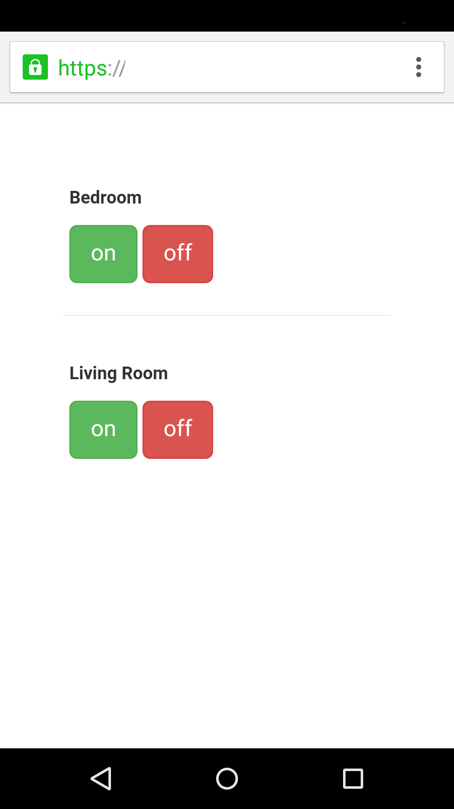

# x10web
*A simple web UI for controlling things via X10 via heyu*

## Setup/Usage

You need to download [Heyu](http://heyu.tanj.com/), install it, and configure it to work as the user you will run x10web as.

After you've done that, setting up x10web is pretty easy:
```bash
# Install build requirements (bower)
sudo apt-get install npm

npm install bower

# Install vendor stuff (bootstrap, jquery)
bower install

# Install python requirements
pip install -r requirements.txt

# Copy the default config
cp x10web.example.conf x10web.conf

# Edit as needed
editor x10web.conf

# Run
python main.py
```

## Screenshots


Pull requests welcome.
